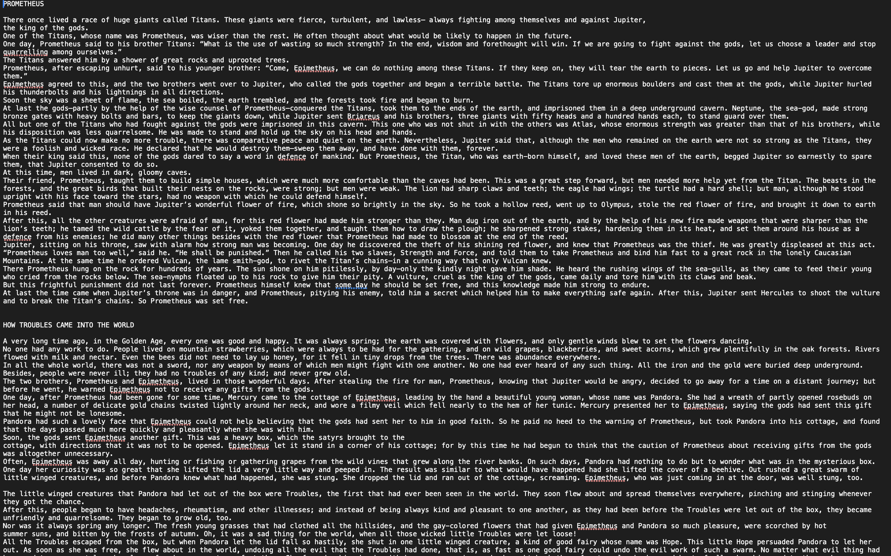

    
    

# Theseus: Greek Myth-Inspired Transformer Language Model

## Overview
Theseus is a transformer-based language model trained to generate Greek Myth-esque text. It can be used to generate creative and mythological narratives.

## Features
- Text generation in the style of Greek myths.
- Customizable parameters for text generation.

## Requirements
- Python
- PyTorch
- GPU for faster training and text generation (recommended)

## Acknowledgments
This model was inspired by the work of Andrej Karpathy.
- Source: [Andrej Karpathy's YouTube Series](https://www.youtube.com/watch?v=kCc8FmEb1nY&list=PLr2aO10UgOBmg2Eu0SbKB0LuptiQQuhpu&index=1)
